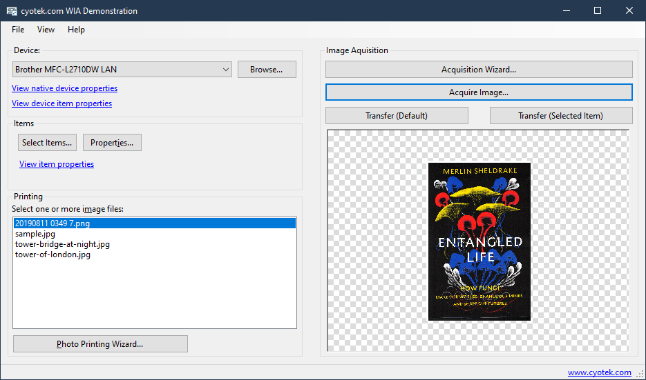

# An introduction to using Windows Image Acquisition (WIA) via C\#

This repository contains a sample application showing the basics
of using the WIA library in C#.

For more information, please see the following article on the
Cyotek blog:

* [An introduction to using Windows Image Acquisition (WIA) via C#](https://www.cyotek.com/blog/an-introduction-to-using-windows-image-acquisition-wia-via-csharp)

## Acknowledgements

* Tower of London source
  https://www.publicdomainpictures.net/en/view-image.php?image=18490
* London Bridge at Night source
  https://www.publicdomainpictures.net/en/view-image.php?image=8250&picture=tower-bridge-at-night
